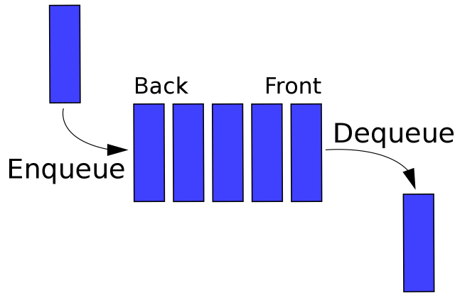

# FIFObuffer

Simple FIFO buffer designed for use with an Arduino

Adapted from [Arduino-FIFO](https://github.com/deisterhold/Arduino-FIFO) by Daniel Eisterhold

Changes made:
- Added extra methods
- You can change the type and size of the buffer

Known issues/TODO:
- `FIFObuffer::get()` doesn't work properly

# Explanation

https://en.wikipedia.org/wiki/FIFO_(computing_and_electronics)



_(image credit Vegpuff/Wikipedia)_

## Example
```cpp
#include "FIFObuffer.h"
#include "iostream"

int main(int args, char **argv) {
    FIFObuffer<int, 3> buffer;
    buffer.put(1);
    buffer.put(2);
    buffer.put(3);
    std::cout << buffer.sum() << "\n";  // outputs 6
}
```